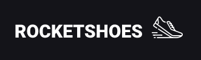
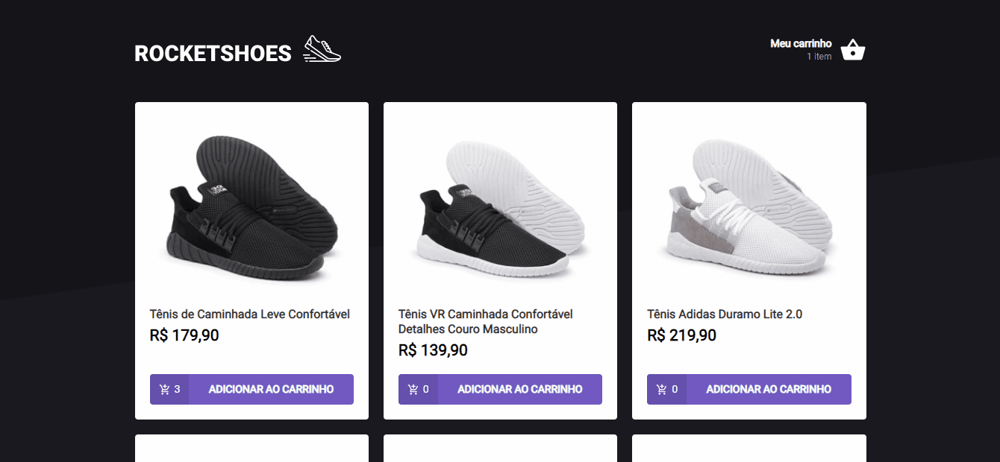

<section align="center">
    
</section>

---

<h2 align="center">Summary</h2>

    <a href="#description">📙 Description</a>
    <a href="#preview">🖼️ Preview</a>
    <a href="#technologies">💻 Technologies</a>

<H2 id="about">📙 Description</H2>

Partial implementation with minor changes of a cart and checkout application using React and Typescript

Originally created on Ignite from <a href="https://www.rocketseat.com.br/">Rocketseat</a> and made by <a href="https://www.linkedin.com/in/kleverson-kenji-iwatani/">Kenji Iwatani</a>

    <h3><a href="https://www.notion.so/Desafio-01-Criando-um-hook-de-carrinho-de-compras-5769216778794019a83f544e79167b12">Challenge description &rarr;</a></h3>

---

<H2 id="preview">🖼️ Preview</H2>

<section align="center">
    
</section>

---

<H2 id="technologies">💻 Technologies</H2>

- [x] <a href="https://reactjs.org/">React</a>
- [x] <a href="https://www.typescriptlang.org/">Typescript</a>